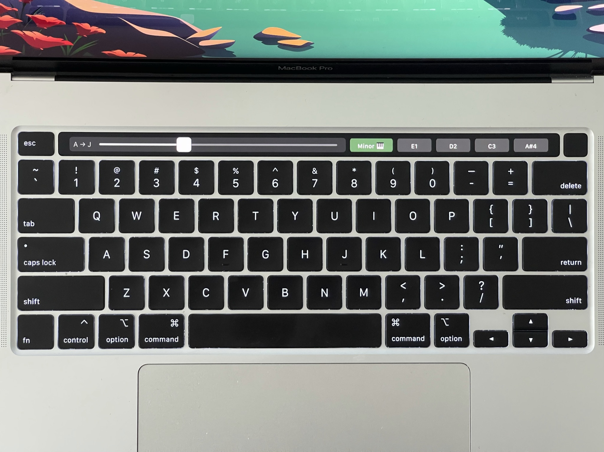
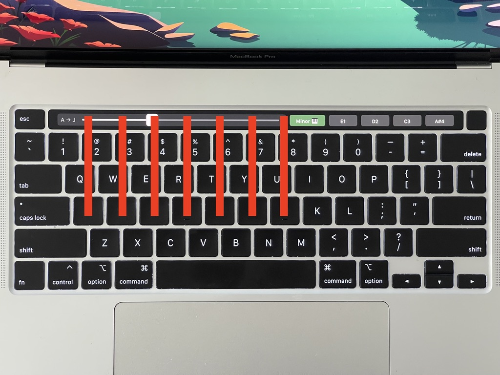
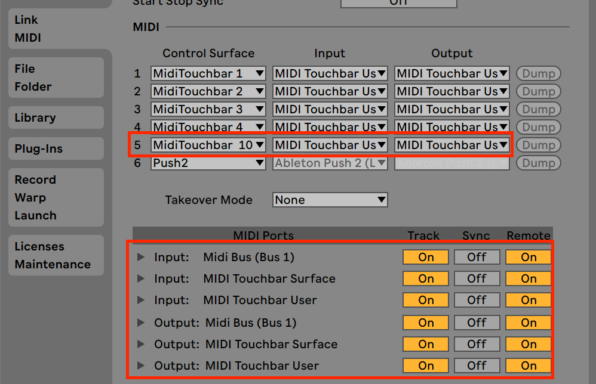
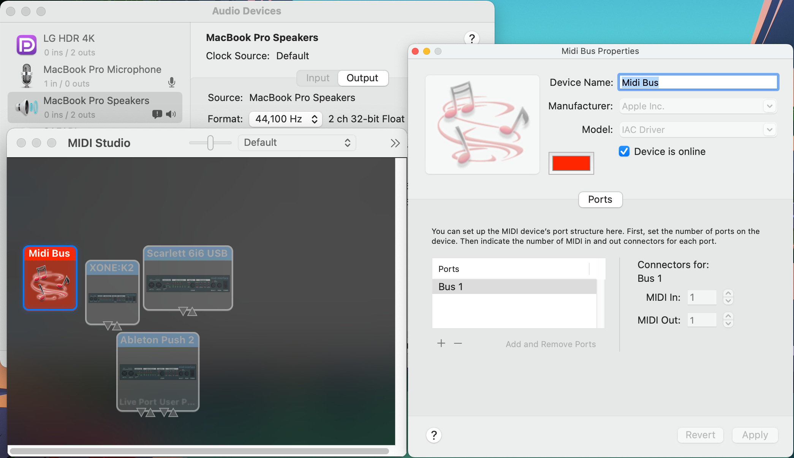
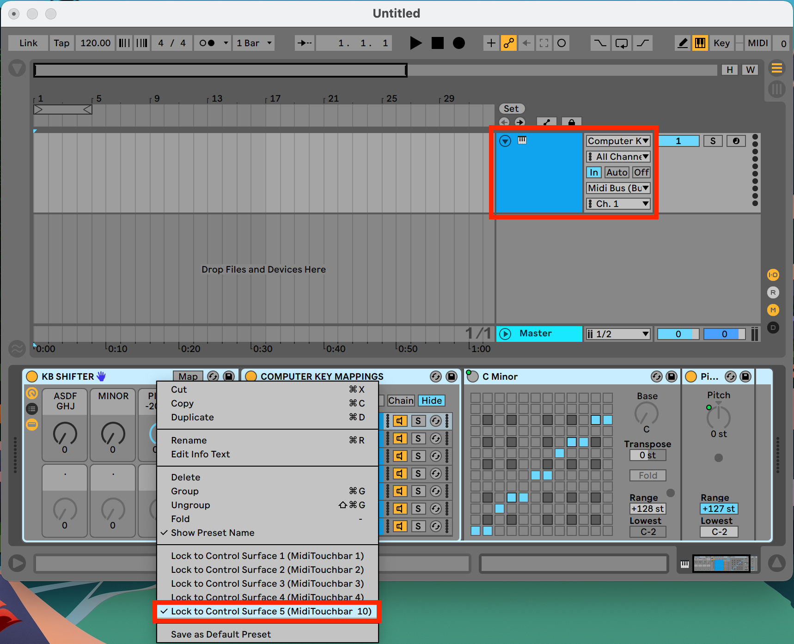
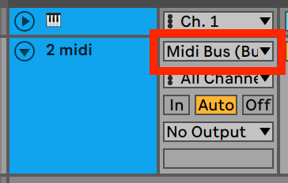
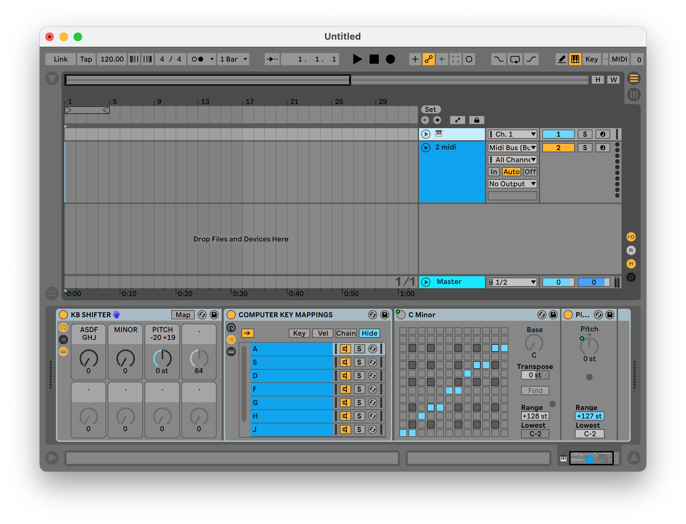

16" Macbook Pro computer keyboard shift
--

Easily play notes in key by using the home row computer keys, with broader range via touchbar slider.



---

Instead of C major triad always being ADG on the keyboard, shift and start on any key, for example DGJ.

After choosing a new starting position, choose any root note and/or the minor scale.

This allows you to play the home row computer keys without memorizing black note / white note patterns.

---




By sacrificing irrelevent notes which may fall on R and I keys, the home row will always be in key.

```
                        E1 F1 F#1 G1 G#1
A2 A#2 B2 C2 C#2 D2 D#2 E2 F2 F#2 G2 G#2
A3 A#3 B3 C3 C#3 D3 D#3 E3 F3 F#3 G3 G#3     <-- (default is C3)
A4 A#4 B4 C4 C#4 D4 D#4 E4 F4 F#4 G4 G#4
```


---

Install
--

**Midi Touchbar**

1. Download and install [Midi Touchbar](https://urbanlienert.com/miditouchbar/)

2. Open Midi Touchbar → Menu icon → Load Touchbar Settings → `midi-touchbar-keyboard-shifter.xml` (Channel 10)

**Ableton**

3. [Move `MidiTouchbar__10` control script folder](https://help.ableton.com/hc/en-us/articles/206240184-Creating-your-own-Control-Surface-script) for blue-hand control of the Midi Effect Rack

```
Mac: HD:/Users/[Username]/Library/Preferences/Ableton/Live x.x.x/User Remote Scripts
Windows: C:\Users\[Username]\AppData\Roaming\Ableton\Live x.x.x\Preferences\User Remote Scripts
```

4. Ensure Track and Remote in Ableton preferences → Link/Midi




5. For Post-MIDI shift recording, [set up a Midi Bus](https://help.ableton.com/hc/en-us/articles/209774225-How-to-setup-a-virtual-MIDI-bus) -- Ableton normally records Pre-MIDI shift



6. Create a new `🎹 Midi Track` with `KB SHIFTER.adg` rack from this repo, set `Monitoring` to `In`. Set `Midi In` to `Computer Keyboard` and `Midi Out` to `Midi Bus`. Right click the rack → `Lock To Control Surface N (Midi Touchbar 10)`



8. Ableton Preferences → File/Folder → `Save Current Set as Default`

9. Create another Midi Track, set `Midi In` to `Midi Bus` and right click → save as default Midi Track



Anytime you create a new Midi Track, it will get your Post-MIDI shifted notes



Dragging a Midi Instrument directly won't have Midi In set automatically, but creating the Midi Track first will.
